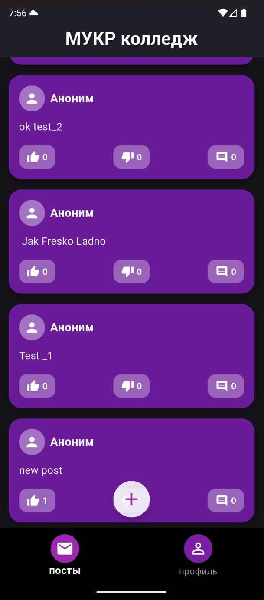
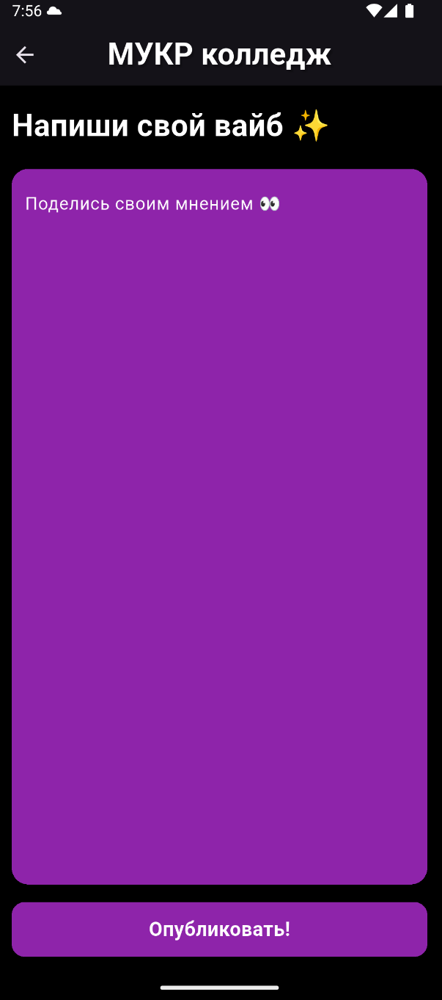
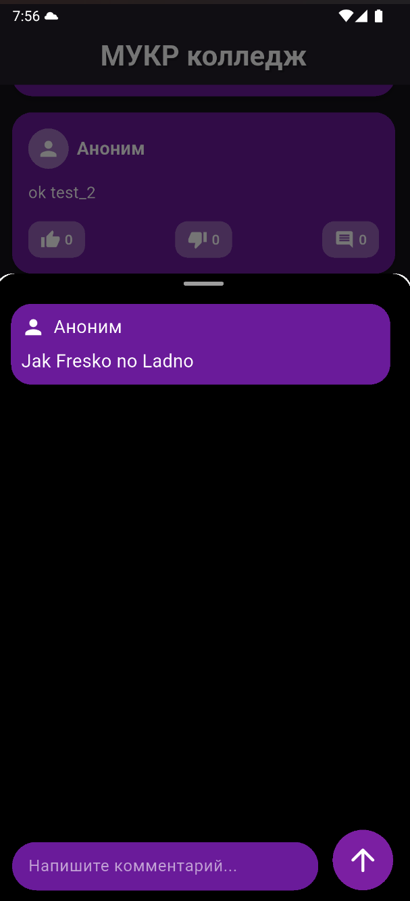

# Anonka

Here in Anonka, you can share with your thoughts anonymously

## App Screenshots

<p float="left">
  
  
  
  
</p>

## Installation & Running

1. Clone repository

```bash
git clone https://github.com/Hati0kooHati/Anonka.git
cd places
```

2. Download dependencies

```bash
flutter pub get
```

3. Running

```bash
flutter run
```

## Technologies
Flutter: ^3.32.4(Stable)
Bloc: ^9.1.1

- freezed_annotation: ^3.1.0
- get_it: ^8.2.0
- injectable: ^2.5.2
- flutter_bloc: ^9.1.1
- package_info_plus: ^9.0.0
- firebase_core: ^4.1.1
- firebase_remote_config: ^6.0.2
- firebase_auth: ^6.1.0
- cloud_firestore: ^6.0.2
- url_launcher: ^6.3.2
- google_sign_in: ^7.2.0
- freezed: ^3.2.3
- build_runner: ^2.4.13
- injectable_generator: ^2.5.1

## Contacts

If you have any questions, feel free to email me: dserion.prn@gmail.com

## License

This project is licensed under the MIT License.
